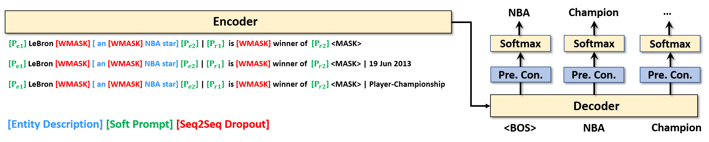

<h1 align="center">
  KG-S2S
</h1>

<h4 align="center">Knowledge Is Flat: A Seq2Seq Generative framework For Various Knowledge Graph Completion</h4>

<h2 align="center">
  Overview of KG-S2S
  
</h2>
This repository includes the source code of the paper accepted by COLING'2022. 

[**"Knowledge Is Flat: A Seq2Seq Generative framework For Various Knowledge Graph Completion".**](https://arxiv.org/abs/2209.07299)

### Dependencies

- Compatible with PyTorch 1.11.0 and Python 3.x.
- Dependencies can be installed using `requirements.txt`.

### Dataset:

- We use WN18RR, FB15k-237N, FB15k-237, ICEWS14 and NELL-One dataset for knowledge graph link prediction. 
- All the preprocessed data are included in the `./data/processed/` directory. Alternatively, you can download the raw 
dataset into `./data/raw/` and run `./preprocess.sh` to generate the processed data.
- Raw data source:
  - [WN18RR, FB15k-237](https://github.com/wangbo9719/StAR_KGC)
  - [ICEWS14](https://github.com/mniepert/mmkb)
  - [reformatted NELL-One](https://github.com/wangbo9719/StAR_KGC)

### Pretrained Checkpoint:

To enable a quick evaluation, we upload the trained model. 
Download the checkpoint folders to `./checkpoint/`, and run the evaluation commandline for corresponding dataset.

The results are:

|  Dataset   |   MRR    |  H@1   |  H@3   |  H@10  |                                        checkpoint                                        | 
|:----------:|:--------:|:------:|:------:|:------:|:----------------------------------------------------------------------------------------:|
|   WN18RR   | 0.575838 | 52.97% | 60.05% | 66.59% | [download](https://drive.google.com/drive/u/2/folders/11WvghBmzoZjmyxP85FpkyxPgNfMS462G) | % 10938
| FB15k-237  | 0.335011 | 25.73% | 36.91% | 49.61% |                                            -                                             | % 12342
| FB15k-237N | 0.354474 | 28.42% | 39.04% | 49.22% | [download](https://drive.google.com/drive/u/2/folders/1JSZp439WVcMSG71bqSO9NathWFk90Be6) | % 11077
|  ICEWS14   | 0.589678 | 51.09% | 63.78% | 73.20% |                                            -                                             | % 12165

| Dataset |   MRR    |  H@1   |  H@5   |  H@10  |                                        checkpoint                                        |
|:-------:|:--------:|:------:|:------:|:------:|:----------------------------------------------------------------------------------------:|
|  NELL   | 0.318289 | 23.68% | 41.20% | 49.72% | [download](https://drive.google.com/drive/u/2/folders/1_bEvDPEsGEKDqyjKQikfjmkqkbB-7jVI) | % 11944


### Training and testing:

- Install all the requirements from `./requirements.txt.`
- Commands for reproducing the reported results:
  ##### WN18RR
  ```shell
  python3 main.py -dataset 'WN18RR' \
                  -lr 0.001 \
                  -epoch 100 \
                  -batch_size 64 \
                  -src_descrip_max_length 40 \
                  -tgt_descrip_max_length 10 \
                  -use_soft_prompt \
                  -use_rel_prompt_emb \
                  -seq_dropout 0.1 \
                  -num_beams 40 \
                  -eval_tgt_max_length 30 \
                  -skip_n_val_epoch 30 \
  
  # evaluation commandline:
  python3 main.py -dataset 'WN18RR' \
                  -src_descrip_max_length 40 \
                  -tgt_descrip_max_length 10 \
                  -use_soft_prompt \
                  -use_rel_prompt_emb \
                  -num_beams 40 \
                  -eval_tgt_max_length 30 \
                  -model_path path/to/trained/model \
                  -use_prefix_search
  ```
  ##### FB15k-237N
  ```shell
  python3 main.py -dataset 'FB15k-237N' \
                  -lr 0.001 \
                  -epoch 50 \
                  -batch_size 32 \
                  -src_descrip_max_length 80 \
                  -tgt_descrip_max_length 80 \
                  -use_soft_prompt \
                  -use_rel_prompt_emb \
                  -seq_dropout 0.2 \
                  -num_beams 40 \
                  -eval_tgt_max_length 30 \
                  -skip_n_val_epoch 30

  # evaluation commandline:
  python3 main.py -dataset 'FB15k-237N' \
                  -src_descrip_max_length 80 \
                  -tgt_descrip_max_length 80 \
                  -use_soft_prompt \
                  -use_rel_prompt_emb \
                  -num_beams 40 \
                  -eval_tgt_max_length 30 \
                  -model_path path/to/trained/model \
                  -use_prefix_search  
  ```
  ##### FB15k-237
  ```shell
  python3 main.py -dataset 'FB15k-237' \
                  -lr 0.001 \
                  -epoch 40 \
                  -batch_size 32 \
                  -src_descrip_max_length 80 \
                  -tgt_descrip_max_length 80 \
                  -use_soft_prompt \
                  -use_rel_prompt_emb \
                  -seq_dropout 0.2 \
                  -num_beams 40 \
                  -eval_tgt_max_length 30 \
                  -skip_n_val_epoch 20

  # evaluation commandline:
  python3 main.py -dataset 'FB15k-237' \
                  -src_descrip_max_length 80 \
                  -tgt_descrip_max_length 80 \
                  -use_soft_prompt \
                  -use_rel_prompt_emb \
                  -num_beams 40 \
                  -eval_tgt_max_length 30 \
                  -model_path path/to/trained/model \
                  -use_prefix_search 
  ```

  ##### ICEWS14
  ```shell
  python3 main.py -dataset 'ICEWS14' \
                  -lr 0.0005 \
                  -epoch 100
                  -batch_size 32 \
                  -src_descrip_max_length 40 \
                  -tgt_descrip_max_length 40 \
                  -temporal  \
                  -use_soft_prompt \
                  -use_rel_prompt_emb \
                  -seq_dropout 0.1 \ 
                  -num_beams 40 \
                  -eval_tgt_max_length 26 \
                  -skip_n_val_epoch 50
  
  # evaluation commandline:
  python3 main.py -dataset 'ICEWS14' \
                  -src_descrip_max_length 40 \
                  -tgt_descrip_max_length 40 \
                  -temporal  \
                  -use_soft_prompt \
                  -use_rel_prompt_emb \
                  -num_beams 40 \
                  -eval_tgt_max_length 26 \
                  -model_path path/to/trained/model \
                  -use_prefix_search  
  ```
  
  ##### NELL-One
  ```shell
  python3 main.py -dataset 'NELL' \
                  -lr 0.0005 \
                  -epoch 30 \
                  -batch_size 128 \
                  -src_descrip_max_length 0 \
                  -tgt_descrip_max_length 0 \
                  -use_soft_prompt \
                  -use_rel_prompt_emb \
                  -num_beams 40 \
                  -eval_tgt_max_length 25 \
                  -skip_n_val_epoch 15

  
  # evaluation commandline:
  python3 main.py -dataset 'NELL' \
                  -src_descrip_max_length 0 \
                  -tgt_descrip_max_length 0 \
                  -use_soft_prompt \
                  -use_rel_prompt_emb \
                  -num_beams 40 \
                  -eval_tgt_max_length 25 \
                  -model_path path/to/trained/model \
                  -use_prefix_search  
  ```
  - `-src_descrip_max_length` denotes the training batch size
  - `-src_descrip_max_length` denotes the maximum description length for source entity during training 
  - `-tgt_descrip_max_length` denotes the maximum description length for target entity during training
  - `-eval_tgt_max_length` denotes the maximum description length for generation during inference  
  - `-use_soft_prompt` denotes the option whether to use soft prompt
  - `-use_rel_prompt_emb` denotes the option whether to use relation-specific soft prompt (need to enable `-use_soft_prompt`) 
  - `-seq_dropout` denotes the value for sequence dropout
  - `-use_prefix_search` denotes to use constrained decoding method
  - `-temporal` denotes the dataset is for temporal knowledge graph completion
  - `-skip_n_val_epoch` denotes the number of training epochs without evaluation (evaluation is costly due to the auto-regressive decoding) 


### Citation

If you used our work or found it helpful, please use the following citation:
```
@inproceedings{KG_S2S,
    title = "Knowledge Is Flat: A Seq2Seq Generative Framework for Various Knowledge Graph Completion",
    author = "Chen, Chen  and
      Wang, Yufei  and
      Li, Bing  and 
      Lam, Kwok-Yan",
    booktitle = "Proceedings of the 29th International Conference on Computational Linguistics",
}
```
