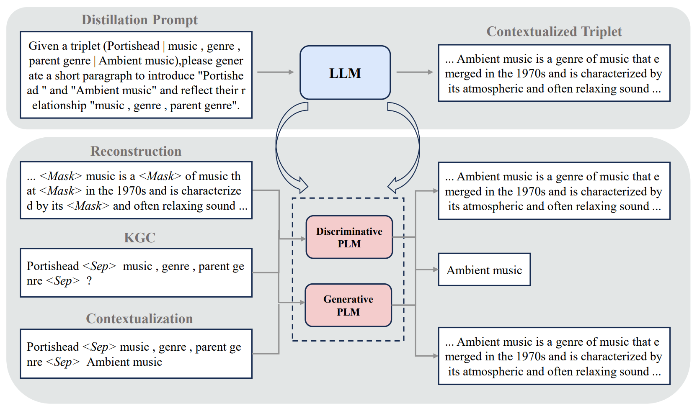

<div align="center">

Contextualization Distillation from Large Language Models for Knowlege Graph Completion

</div>

## Update

4.24: add KG-S2S implementation and descriptive context files.

## Overview

<p align="center">
  
</p>

## Dependency

To fully run this project, one is recommended to install the requirement packages for each KGC baseline (best to install them separately), with the [OpenAI](https://github.com/openai/openai-python) and [PaLM](https://ai.google.dev/palm_docs/tuning_quickstart_python) libraries as well.

## Benchmark LLMs' Performance in KGC

To benchmark the two large language models' (PaLM and ChatGPT) performance in KGC, first enter your api keys into ``KGE-LLM/utils.py``

```
palm.configure(api_key='your own plm api key')
API_KEY = 'your own openai api key'
```

then revise the dataset variable in ``KGE-LLM/inference_palm.py`` or ``KGE-LLM/inference_chatgpt.py``, and run the corresponding script. Use the scripts with the suffix "_yoga" to get the result on Yoga3.


## Extract Descriptive Context from LLMs

To generate descriptive context from PaLM as the auxiliary corpus for the following steps, one can directly run:

```
cd KGE-LLM
python run.sh
```

After runing the script, you should get two data files ``knowledge_context.txt`` in the corresponding dataset folder.

We will later provide the generated corpus [here](https://drive.google.com/drive/folders/1QQAKEAIELteDhlR_ScZczf41L2iE_PLy?usp=sharing) and the post-processing script.


## Contextualization Distillation with Different KGC Baselines

To apply our contextualization distillation framework in each KGC baseline, first copy the two processed data files to the KGC baseline's dataset folder.

### KG-BERT

For KG-BERT on WN18RR, run

```
cd kg-bert
bash train_wn18rr.sh
```

For KG-BERT on FB15k-237N, run

```
cd kg-bert
bash train_fb15k237N.sh
```

### CSProm-KG

For CSProm-KG on WN18RR, run

```
cd CSProm-KG
bash train_wn18rr.sh
```

For CSProm-KG on FB15k-237N, run

```
cd CSProm-KG
bash train_fb15k237N.sh
```

### GenKGC

For GenKGC on WN18RR, run

```
cd lambdaKG/scripts/kgc
bash genkgc_WN18RR.sh
```

For GenKGC on FB15k-237N, run

```
cd lambdaKG/scripts/kgc
bash genkgc_FB15k-237N.sh
```

### KG-S2S

For KG-S2S on WN18RR, run

```
cd KG-S2S
bash train_wn18rr.sh
```

For KG-S2S on FB15k-237N, run

```
cd KG-S2S
bash train_fb15k237N.sh
```

Credits: This work began as a fork of several KGC models' repository: [KG-BERT](https://github.com/yao8839836/kg-bert), [CSProm-KG](https://github.com/chenchens190009/CSProm-KG), [PromptKG](https://github.com/zjunlp/PromptKG) and [KG-S2S](https://github.com/chenchens190009/KG-S2S). If you found our code useful, please consider citing:

```
@inproceedings{li-etal-2024-contextualization,
    title = "Contextualization Distillation from Large Language Model for Knowledge Graph Completion",
    author = "Li, Dawei  and
      Tan, Zhen  and
      Chen, Tianlong  and
      Liu, Huan",
    editor = "Graham, Yvette  and
      Purver, Matthew",
    booktitle = "Findings of the Association for Computational Linguistics: EACL 2024",
    month = mar,
    year = "2024",
    address = "St. Julian{'}s, Malta",
    publisher = "Association for Computational Linguistics",
    url = "https://aclanthology.org/2024.findings-eacl.32",
    pages = "458--477",
    abstract = "While textual information significantly enhances the performance of pre-trained language models (PLMs) in knowledge graph completion (KGC), the static and noisy nature of existing corpora collected from Wikipedia articles or synsets definitions often limits the potential of PLM-based KGC models. To surmount these challenges, we introduce the \textit{Contextualization Distillation} strategy, a versatile plug-in-and-play approach compatible with both discriminative and generative KGC frameworks. Our method begins by instructing large language models (LLMs) to transform compact, structural triplets into context-rich segments. Subsequently, we introduce two tailored auxiliary tasks{---}reconstruction and contextualization{---}allowing smaller KGC models to assimilate insights from these enriched triplets. Comprehensive evaluations across diverse datasets and KGC techniques highlight the efficacy and adaptability of our approach, revealing consistent performance enhancements irrespective of underlying pipelines or architectures. Moreover, our analysis makes our method more explainable and provides insight into how to generate high-quality corpora for KGC, as well as the selection of suitable distillation tasks.",
}
```